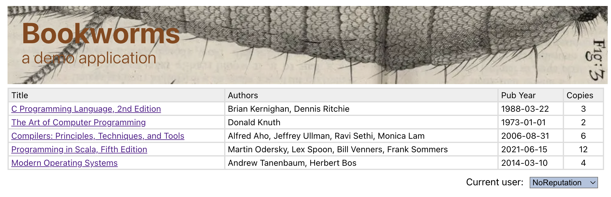
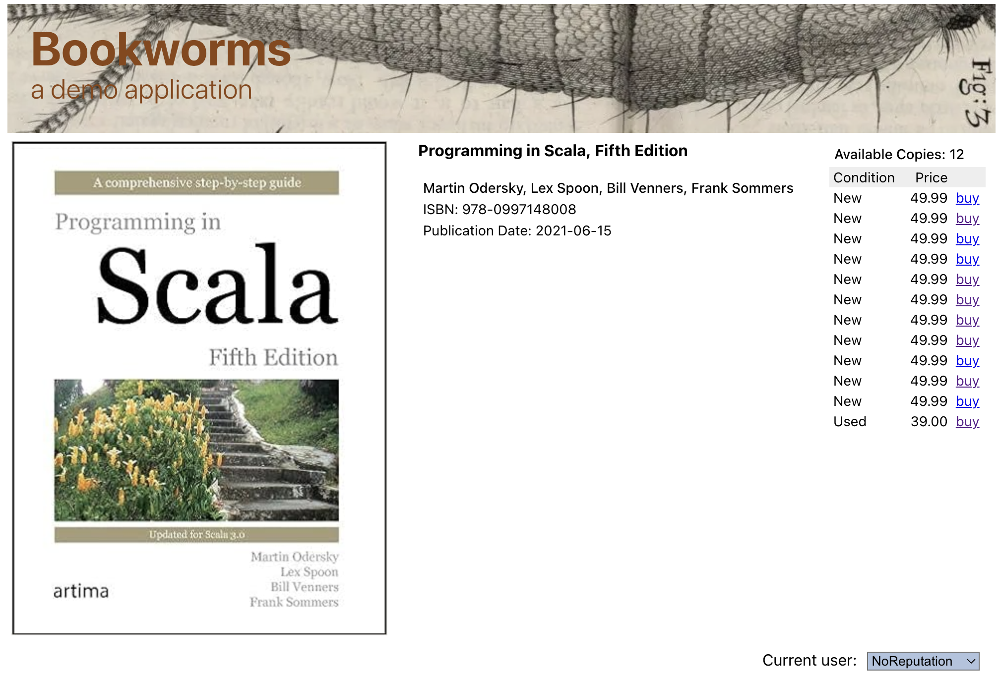
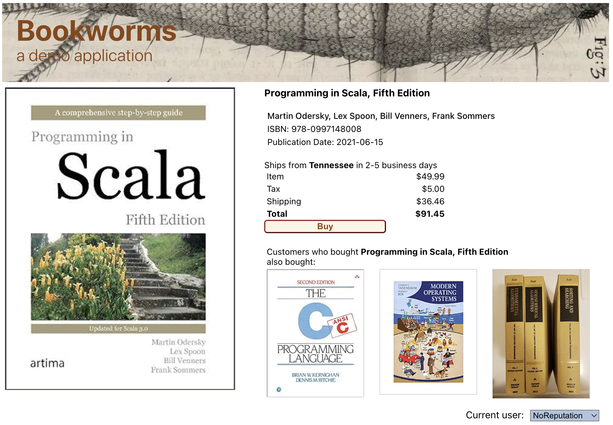
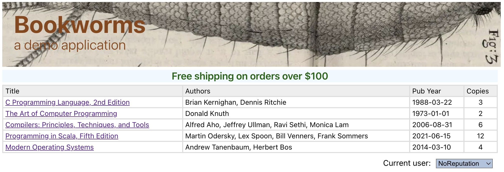
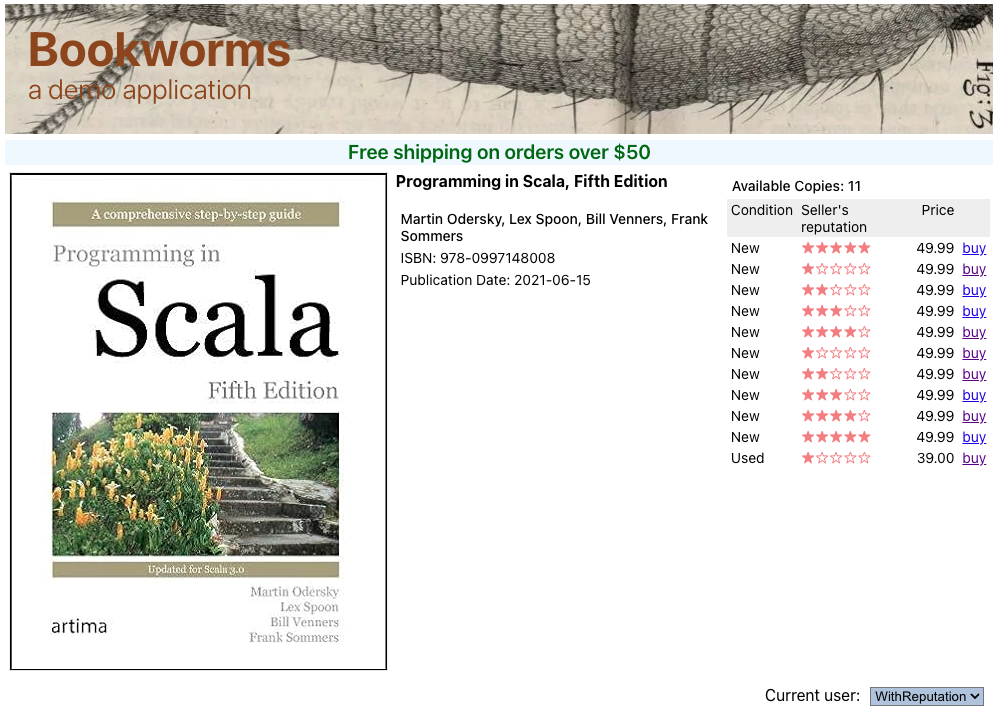

# Bookworms Demo Application 
#### Version 1.2

Demonstrates instrumentation of an A/B test and a feature flag with 
[Variant CVM Server](https://getvariant.com). The demo application is a simple host webapp called Bookworms
written in NodeJS on the front-end and a back-end API server written in Scala on top of the Akka HTTP
Web server. The API backend utilizes Variant Java SDK to communicate with Variant server.

__A fully fledged copy of Variant Code Variation Management Server is included with this demo. You are
allowed to continue using it in development, but not in production. If you wish to try Variant in production,
you must obtain a production license.__

Complete Docs at https://getvariant.com

### 1. Downloading and Configuring

#### Clone this repository 
```shell
git clone git@github.com:getvariant/variant-demo-jvm-bookworms.git
```
The repository has the following four directories:
* `api` Bookworms' backend API written in Scala with Akka HTTP. This is the module that uses Variant
Java SDK to communicate with Variant server. (Scala is a JVM language fully capabale of consuming Java services.)
* `node` Bookworms' frontend written in NodeJS.
* `server` contains a zip archive of a complete Variant CVM server. 
* `spi` Java sources for the server-side extensions used by this demo.

#### Deploy Variant CVM Server
* Copy the Variant server distribution Zip archive to a directory of your choice outside this
repository, e.g. `/tmp`, and inzip.
```shell
cp server/variant-server-<release>.zip /tmp
cd /tmp
unzip variant-server-<release>.zip
```
This will create the complete server directory structure in `/tmp/variant-server-<release>`

* Copy the Variant schema file `bookworms.yaml` to the server's `schemata` directory:
```shell
cp server/bookworms.yaml /tmp/variant-server-<release>/schemata
```
* Edit the Variant config file `/tmp/variant-server-<release>/conf/variant.conf`. Uncomment
and change the value of the parameter `event.writer.max.delay` which forces the flushing of the event
buffers to disk:
```text
 event.writer.max.delay = 1
```
This will ensure that you'll be able to see variant trace events written out to disk with a delay of
at most one second.

* Build the server-side extensions and copy them to where the running server will be able to find them:
```shell
cd spi
mvn clean package
cp target/bookworms-spi-<release>.jar /tmp/variant-server-<release>/spi
```

* Start Variant server:
```shell
/tmp/variant-server-<release>/bin/variant start
```
This will start Variant server in the foreground and you should see the following output:
```text
...
2024-02-29 13:40:11,280 INFO - c.v.s.schema.ServerFlusherService - [431] Initialized flusher [TraceEventFlusherCsv] for schema [bookworms]
2024-02-29 13:40:11,303 INFO - c.v.s.schema.Schemata - [422] Deployed schema [bookworms] from file [bookworms.yaml]
...
2024-02-29 13:40:11,314 INFO - c.v.s.impl.VariantServerImpl - [410] Variant CVM Server release 1.3.0 started on port [5377] in 1.257s
```

Note that the Bookworms variation schema uses the trace event flusher that writes trace events into the local
comma-separated values (CSV) file `/tmp/variant-server-<release>/log/trace-events.csv`

#### Create the Postgres Database
Assuming you have Docker installed (e.g. Docker Desktop for MacOS),
```shell
cd api/src/db
./postgres-up.sh
./schema.sh
```
This will:
* Deploy a PostgreSQL 13 database in a Docker container with the root user `postgres` listening on port `5432`;
* Create user `bookworms` with password `bookworms`;
* Create database `bookworms` owned by user `bookworms`;
* Create the tables used by the Bookworms application in the database `bookworms`.

If you change any of these setting, be sure to update `api/src/main/resources/application.conf`.

If you'd rather run with a locally installed Postgres, any recent version should do. It should be
easy to adopt `postgres-up.sh` and `schema.sh` for the local case.

#### Run Bookworms API Server
In a new shell:
```shell
% cd api
% sbt run
```
This will start the Bookworms API server on `localhost:8080`.

#### Run Node Frontend
In a new shell:
```shell
% cd node
% npm install
```
This will download required Node modules. You should only have to do it once on a newly cloned
repository. To start Node:
```shell
% npm start
```
Point your browser `localhost:3000`.

### 2. Running the Demo

#### 2.1 The Bookworms Host Application
The Bookworms application simulates an on-line used book store specializing in classic computer
science texts. The home page displays a list of books currently available for purchase 
along with the number of available copies:

Clicking on a title navigates to the book details page, listing more details about the title
and all the copies available for sale:

Finally, clicking on one of the available copies, navigates to the checkout page:


Note as well the current user dropdown at bottom right of every page. It is used to switch between
two users: `NoReputation` and `WithReputation`.

The two code variations instrumented in this demo are defined in the variation schema file
`booksworms.yaml` and are discussed next.

#### 2.2 The Free Shipping Experiment
`FreeShippingExp` tests the hypothesis that offering free shipping to inactive customers will
lead to more sales. The control experience `Nada` implements no offer, while the two treatments `On50`
and `on100` implement the free shipping offer experience for minimum purchase of $50 and $100 respectively.
The qualification logic of whether the user is inactive is implemented by the class 
[`FreeShippingExpQualificationHook`](spi/src/main/java/com/variant/demo/bookworms/spi/FreeShippingExpQualificationHook.java) which can be found in the `spi` module. In real life this hook would
likely read the operational database for the up-to-date information about the user's most recent purchase,
but we emulate the logic by examining the `isActive` session attribute set by the Bookworms API server.

The initial state of every user is inactive, so all users qualify for the free shipping experiment. 
There is no custom targeting hook for the free shipping experiment; the default built-in targeting
hook distributes qualified traffic randomly and equally between all available experiences. If, by the luck
of the draw, your session gets targeted to the control experience `Nada`, there will be no changes
to the user experience, and the visit to the home page will generate two trace events in the event log file
`server/variant-server-<release>/log/trace-events.csv`: 
```text
"FC1132D34515DBAA288A7C9CEA02AFCB","FreeShippingExpQualificationHook: Qualified user 'NoReputation'","2024-02-29T23:45:26.563907Z","3AF6DDEF7B3ADE7A","NoReputation","[]","{}"
"8BA716DB31B10B7685AFFD90317F485E","$STATE_VISIT","2024-02-29T23:45:26.850380Z","3AF6DDEF7B3ADE7A","NoReputation","[FreeShippingExp.Nada]","{$STATE:Home,$STATUS:Committed}"
```
Alternatively, if your session is targeted to a treatment experience, you will see the promotional message
displayed on the page:

and the corresponding trace event log:
```text
"09200E703EA700B3A95377C86D619379","FreeShippingExpQualificationHook: Qualified user 'NoReputation'","2024-03-01T00:02:06.526185Z","2325C27ACBD175EF","NoReputation","[]","{}"
"0C8902EEC05CFF0C7CE36B8D9C45D390","$STATE_VISIT","2024-03-01T00:02:06.538678Z","2325C27ACBD175EF","NoReputation","[FreeShippingExp.On100]","{$STATE:Home,$STATUS:Committed}"
```

Whenever the user navigates to the checkout page and clicks the Buy button, he will no longer see the promo
message because he no longer satisfies the qualification criteria for the experiment, as evidenced by this
custom trace event in the log:
```text
"9E5DECB5B0A9017B1DCA163DB35B69ED","FreeShippingExpQualificationHook: Disqualified user 'NoReputation'","2024-03-01T03:04:37.629349Z","189AB949E3744050","NoReputation","[]","{}"
```
It took no application code to implement this behavior. It was achieved declaratively with the qualification
durability declared as `state` in the variation schema file `bookworms.yaml`:
```yaml
...
    durability:
      qualification: state
...
```

Each experiment can declare the durability setting
for its qualification and (separately) targeting outcomes. By default, both are retained for the duration of
user's current session, but will be re-evaluated on a subsequent visit. There are also two other durability scopes,
`state` and `variation`. (Remember, `variation` is our generic term for either an experiment or a feature flag —
we don't discriminate between them.) The `state` durability scope is finer than the default `state`-scoped 
durability: decisions are re-evaluated on every state request.

#### 2.3 The Reputation Feature Flag
Concurrently with the free shipping experiment we also demo the reputation feature flag `ReputationFF`.
It's instrumented on the `Book Details` and the  `Checkout` pages and gates early access to the feature
still under development, which displays the seller's reputation:


The traffic is opted into the feature
by the [`ReputationFFQualificationHook`](spi/src/main/java/com/variant/demo/bookworms/spi/ReputationFFQualificationHook.java) 
qualification hook, which simply opts in the user `WithReputation` and disqualifies the user `NoReputation`.
(In real life the qualification hook is likely to implement a much more complex logic.)

Naturally, the `ReputationFF` flag only has one experience, reflecting the fact that the other experience is
`nil`.